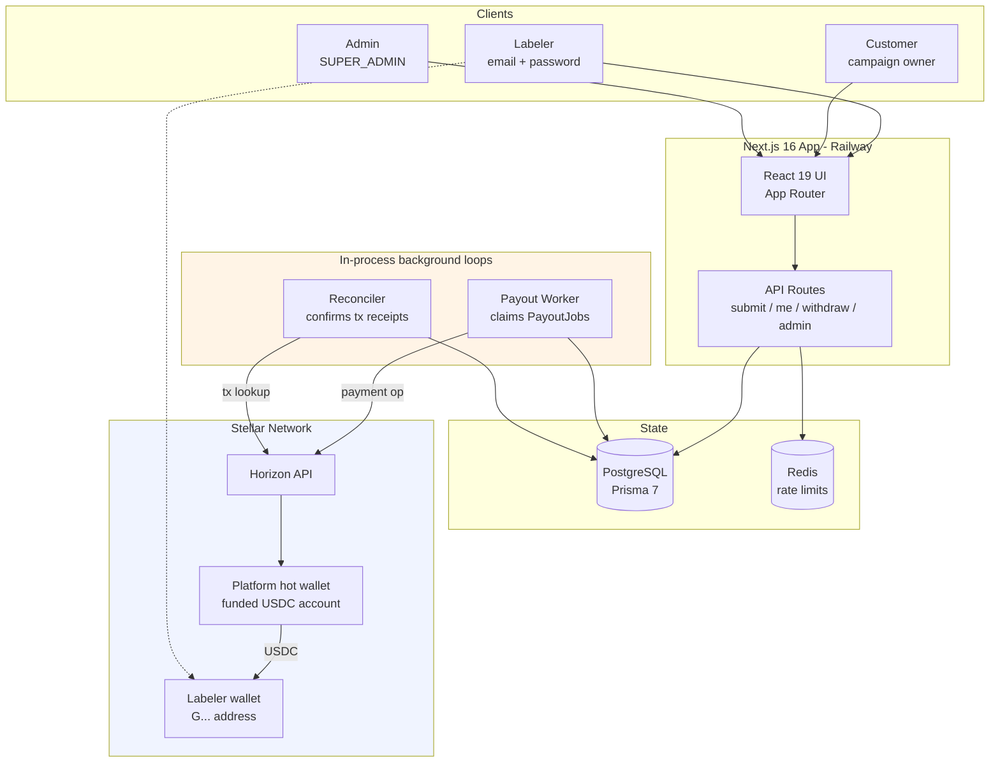
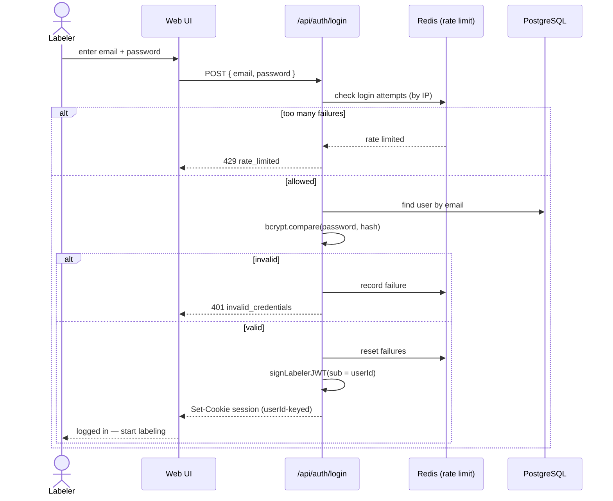
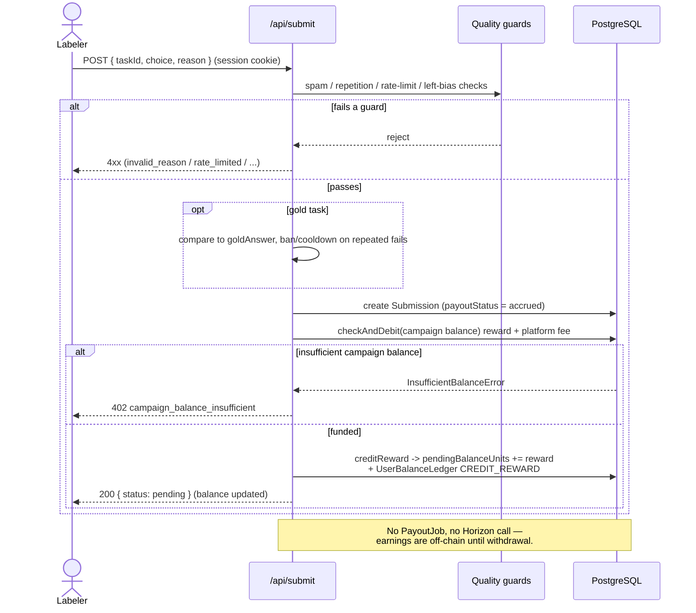
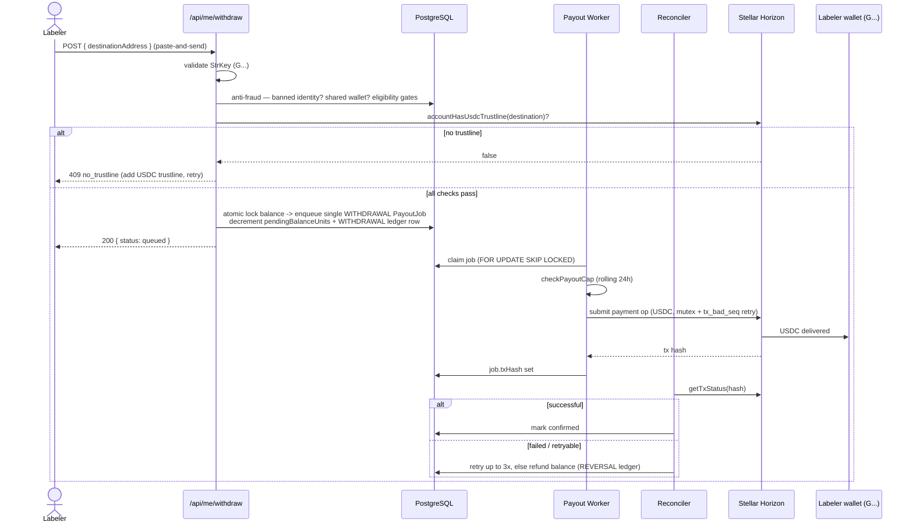

# Centient — Train AI, cent by cent.

[](https://github.com/webnxt-2030/t2p/actions/workflows/ci.yml)

Centient is a **data labeling platform** where people earn **USDC on Stellar** by
ranking AI-generated response pairs. AI developers upload output pairs to be judged
by a human crowd; built-in quality guards (gold tasks, rate limiting, spam and bias
detection, inter-annotator agreement) keep the results reliable. Labelers accrue an
off-chain balance as they work and cash it out to any Stellar wallet in a single
on-chain withdrawal.

**Goal:** Make AI alignment through human feedback accessible and instantly
rewarding for anyone with an internet connection — no bank account required.

---

## DEMO ACCOUNTS

User (Labeler)
demo@centient.work
Demo!123

Admin (Issuer) - https://centient.work/admin/login
admin@centient.work
GoCent!123

## Tech Stack

| Layer | Choice |
|---|---|
| Framework | Next.js 16 (App Router) + React 19 |
| Language | TypeScript 5.4 |
| Styling | Tailwind CSS 4 |
| Database | PostgreSQL + Prisma 7 |
| **Settlement** | **Stellar** classic (Horizon) payments via `@stellar/stellar-sdk` 16 |
| **Asset** | **USDC** — Circle's Stellar-issued asset (7-decimal units) |
| Wallets (withdrawal) | Freighter / Albedo (`@stellar/freighter-api`, `@albedo-link/intent`) |
| Rate limiting | Redis (`ioredis`) |
| Email | Resend |
| Observability | Sentry |
| Deploy | Railway |

---

## Why there is no smart contract (and no testnet contract address)

**Centient ships no Soroban smart contract, so there is no contract testnet
address to publish.** This is a deliberate architectural decision, not an omission.

Payout in Centient is a single, simple operation: a trusted platform hot wallet
sends a fixed-asset (USDC) transfer to a labeler's address. Stellar's **native
classic `payment` operation** already does exactly that — atomically, with sub-5-second
finality and fees on the order of a fraction of a cent. There is no custom
on-chain state, no escrow logic, and no multi-party settlement that would justify
executable on-chain code.

Choosing classic Horizon payments over a Soroban contract means:

- **No custody logic on-chain to get wrong.** The riskiest part of any payout system
  is the money-moving code; a `payment` op is battle-tested protocol primitive, not
  bespoke WASM we would have to write, audit, and secure.
- **No WASM build, audit, contract rent, or TTL/bump management.** Soroban contracts
  incur storage rent and time-to-live upkeep; a payment op has none of that.
- **USDC is already on-chain.** We pay in Circle's issued USDC asset (referenced by
  its *issuer account*, not a contract we deployed), so there is nothing for us to
  mint or manage.
- **Smaller attack surface + faster to ship.** Fewer moving parts, cheaper per-tx,
  and a mainnet cutover that is a config-only network swap.

The one Stellar-native constraint we *do* handle is **trustlines**: a recipient must
hold a USDC trustline before they can be paid (a payment to an untrusted account
fails with `op_no_trust`). We pre-check this at withdrawal and optionally
platform-sponsor the trustline reserve (see `lib/sponsored-trustline.ts`).

> **Network:** everything runs on Stellar **testnet** by default and flips to
> **mainnet** by changing `STELLAR_NETWORK` + the USDC issuer env — no code change.

---

## System Architecture

Centient is a single Next.js deployment (web + API routes) backed by PostgreSQL and
Redis, with two long-lived background loops — the **payout worker** and the
**reconciler** — that run *in-process* inside the web server (see
`instrumentation.ts`) unless split out with `RUN_WORKERS=false`. Jobs are claimed
with `FOR UPDATE SKIP LOCKED`, so the loops stay correct even when the app is scaled
horizontally.



### The two-object identity model

The core design splits two things that used to be the same object:

- **Identity** — a labeler is a `User.id` (UUID), logged in with **email + password**
  (bcrypt). No wallet is needed to sign up or to earn.
- **Payout target** — a Stellar `G…` address, supplied only **at withdrawal**.

Earnings accrue to an **off-chain balance** (`User.pendingBalanceUnits`, audited via
`UserBalanceLedger`). Nothing touches the chain until the labeler withdraws, at which
point the whole accrued balance is paid out in **one lump-sum USDC transfer**. This
"accumulate-then-withdraw" model minimizes on-chain fees and cleanly separates cheap,
mass-createable email identities from the money-moving boundary where anti-fraud
gates live.

### Money & precision

USDC on Stellar uses integer **units** at 7 decimal places (1 USDC = 10,000,000
units). All amounts are stored and computed as `BigInt` units; conversion to the
decimal string the SDK's `payment` op expects is centralized in `lib/stellar/config.ts`
(`usdcToUnits` / `unitsToUsdcString`) using only string/BigInt arithmetic — never
floating point.

---

## Sequence Diagrams

### 1. Labeler auth (email + password)



### 2. Earning — submit an answer (off-chain accrual, no on-chain tx)



### 3. Withdrawal — one on-chain USDC lump sum



---

## Getting Started

### Prerequisites

- Node.js 22.12+
- pnpm (`npm i -g pnpm`)
- Docker (for local PostgreSQL)
- A funded Stellar **testnet** account for the platform hot wallet
  (generate a keypair, fund via [friendbot](https://friendbot.stellar.org),
  add a USDC trustline)

### Setup

```bash
git clone https://github.com/webnxt-2030/t2p.git
cd t2p
pnpm install
pnpm setup     # generates .env.local, starts Postgres, migrates + seeds
pnpm dev
```

`pnpm setup` produces a bootable `.env.local` — every required key is generated or
stubbed so no route 500s on a missing value. It's **idempotent and non-destructive**:
re-running never overwrites a real secret you've already set. It then starts the `db`
container, applies migrations, and seeds test data.

**Before real payouts work**, set the Stellar keys in `.env.local`:

| Key | Meaning |
|---|---|
| `STELLAR_NETWORK` | `testnet` (default) or `public` (mainnet) |
| `STELLAR_PLATFORM_SECRET` | `S…` secret seed of the funded platform hot wallet |
| `STELLAR_USDC_ISSUER` | USDC issuer `G…` (testnet default is Circle's test USDC) |
| `MIN_WITHDRAWAL_UNITS` | Minimum withdrawal in USDC units (default `10000000` = 1 USDC) |

Once seeded, log in to test every area:

| Account | Email | Password | Access |
|---------|-------|----------|--------|
| Admin | `admin@centient.work` | `GoCent!123` | `SUPER_ADMIN` — full admin dashboard |
| Customer | `centient@centient.work` | `GoCent!123` | `CUSTOMER` — campaign owner views |

> Not using Docker for Postgres? Run `pnpm setup:env` (env only), point
> `DATABASE_URL` at your own database, then `pnpm db:deploy && pnpm db:seed`.
>
> Seeing `P3005 — database schema is not empty`? Your local DB predates the
> migration history. Rebuild it cleanly with `pnpm db:reset` (destructive).

### Going to mainnet

The cutover is config-only: set `STELLAR_NETWORK=public`, point `STELLAR_USDC_ISSUER`
at Circle's mainnet USDC issuer, fund the platform account with real XLM (reserves +
fees) and USDC, add its trustline, then run one small smoke-test payout and verify it
on [stellar.expert](https://stellar.expert).

---

## Available Scripts

| Command | Description |
|---------|-------------|
| `pnpm setup` | One-command dev setup: env + Postgres + migrate + seed |
| `pnpm setup:env` | Generate/repair `.env.local` only (idempotent) |
| `pnpm dev` | Start development server (workers run in-process) |
| `pnpm build` | Generate Prisma client and build for production |
| `pnpm start` | Start production server |
| `pnpm payout` | Run the payout worker standalone (with `RUN_WORKERS=false`) |
| `pnpm reconciler` | Run the receipt reconciler standalone |
| `pnpm test` | Run the vitest suite |
| `pnpm typecheck` | Type-check without emitting |
| `pnpm db:migrate` | Run database migrations (dev) |
| `pnpm db:deploy` | Deploy migrations (production) |
| `pnpm db:seed` | Seed database with sample data |
| `pnpm db:studio` | Open Prisma Studio |
| `pnpm db:reset` | Reset database (warning: destructive) |

---

## Project Structure

```
├── app/                    # Next.js App Router pages + API routes
│   ├── api/submit          #   earn: validate answer -> accrue off-chain balance
│   ├── api/me/withdraw     #   cash out: one on-chain USDC lump sum
│   ├── api/auth            #   labeler email+password login/register
│   └── admin               #   SUPER_ADMIN dashboard (campaigns, users, ops)
├── components/             # React components
├── lib/
│   ├── stellar/            #   config, client (payUsdc), balance, signature, wallet
│   ├── payout-worker.ts    #   claims PayoutJobs, submits payments, retries + refunds
│   ├── reconciler.ts       #   confirms tx receipts (sent -> confirmed)
│   ├── user-balance.ts     #   off-chain balance ledger (credit / withdraw / reversal)
│   ├── campaign-balance.ts #   prepaid customer balance debit/credit/refund
│   ├── sponsored-trustline.ts  # platform-sponsored USDC trustlines (bounded)
│   └── ...                 #   quality, rate-limit, anti-fraud, withdrawal-eligibility
├── prisma/                 # Schema, migrations, seed scripts
├── instrumentation.ts      # boots in-process payout worker + reconciler
└── docs/                   # Feature + migration design specs
```

## Supporting Links

DEMO VIDEO - https://drive.google.com/drive/folders/1vpdG9uDyfMjMibSOdVLZG1SMn10hgl6j?usp=sharing

PITCH DECK -  https://drive.google.com/drive/folders/1fum1zUZkCSWnntNUm6weRn_5XIyK-ovE?usp=sharing

## License

MIT
</content>
</invoke>
