# Admin sequence diagrams

The three sequence diagrams in [`README.md`](../README.md#sequence-diagrams) cover the
**labeler** side of Centient — auth, earning, withdrawal. This document covers the
**operator** side: the `/admin` surface, its two roles, and the background jobs that keep
the payout rail moving.

Every diagram below was written against the route handlers in `app/api/admin/**` and
`app/api/cron/**` as of the current `develop`. Where a diagram names a status code or an
error string, that string is the literal one the route returns.

## Roles

| Role | Sees | Typical user |
| ---- | ---- | ------------ |
| `CUSTOMER` | Own campaigns only — every query is scoped by `adminUserId: session.sub` | An AI lab funding comparison tasks |
| `SUPER_ADMIN` | Everything, plus trust & safety and payout operations | Centient operator |

`SUPER_ADMIN` is a **strict superset** of `CUSTOMER` (`hasRole()` in `lib/admin-auth.ts`):
anywhere a `CUSTOMER` is required a `SUPER_ADMIN` session is accepted. The reverse is
never true. Routes that are operator-only require `SUPER_ADMIN` explicitly.

## Participants used throughout

| Short name | What it is |
| ---------- | ---------- |
| `MW` | `middleware.ts` — runs on every `/admin/**` and `/api/admin/**` request |
| `Auth` | `lib/admin-auth.ts` — `getAdminSession` / `requireRoleForRoute` / `requireRoleForPage` |
| `DB` | PostgreSQL via Prisma |
| `Audit` | `AdminAuditLog` rows written by `lib/audit.ts` |
| `HZ` | Stellar Horizon |

> **Audit writes are fire-and-forget.** `auditLog()` in `lib/audit.ts` is a `void`
> function — the Prisma `create` is *not* awaited, and its rejection is caught, logged and
> sent to Sentry. A failed audit write therefore never fails the operator action that
> produced it. The diagrams show the audit arrow where the call is made, not where it
> lands.

---

## A. Access control

### A1. Admin login

`POST /api/admin/login` is one of only three paths the middleware lets through
unauthenticated (`/admin/login`, `/api/admin/login`, `/api/admin/logout`). It takes a
**form post**, not JSON, and answers with a 303 redirect either way — so a failure lands
back on the login page with `?error=`, not on a JSON blob.

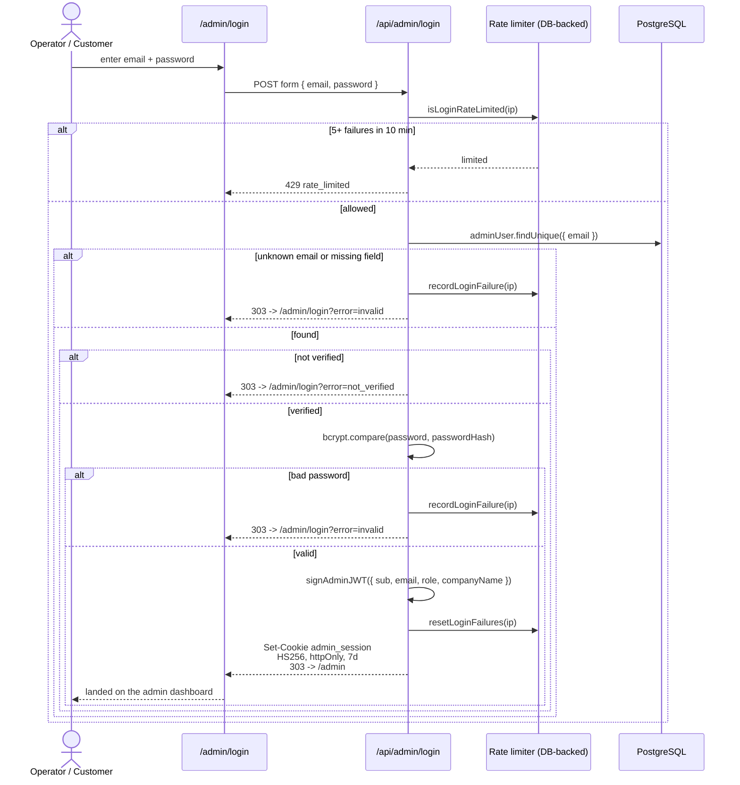
```mermaid
sequenceDiagram
    actor OP as Operator / Customer
    participant UI as /admin/login
    participant API as /api/admin/login
    participant RL as Rate limiter (DB-backed)
    participant DB as PostgreSQL

    OP->>UI: enter email + password
    UI->>API: POST form { email, password }
    API->>RL: isLoginRateLimited(ip)
    alt 5+ failures in 10 min
        RL-->>API: limited
        API-->>UI: 429 rate_limited
    else allowed
        API->>DB: adminUser.findUnique({ email })
        alt unknown email or missing field
            API->>RL: recordLoginFailure(ip)
            API-->>UI: 303 -> /admin/login?error=invalid
        else found
            alt not verified
                API-->>UI: 303 -> /admin/login?error=not_verified
            else verified
                API->>API: bcrypt.compare(password, passwordHash)
                alt bad password
                    API->>RL: recordLoginFailure(ip)
                    API-->>UI: 303 -> /admin/login?error=invalid
                else valid
                    API->>API: signAdminJWT({ sub, email, role, companyName })
                    API->>RL: resetLoginFailures(ip)
                    API-->>UI: Set-Cookie admin_session<br/>HS256, httpOnly, 7d<br/>303 -> /admin
                    UI-->>OP: landed on the admin dashboard
                end
            end
        end
    end
```

Note the deliberate asymmetry: an unknown email and a bad password return the **same**
`error=invalid`, but an unverified account returns `not_verified` *before* the password is
checked and without recording a failure.

### A2. Every authenticated admin request

The middleware is a **signature gate only** — it proves the cookie is a JWT this server
signed and has not expired. It does not read roles. Authorization is decided a second time
inside each route handler or server component, which re-derives the session itself rather
than trusting anything the middleware forwarded.

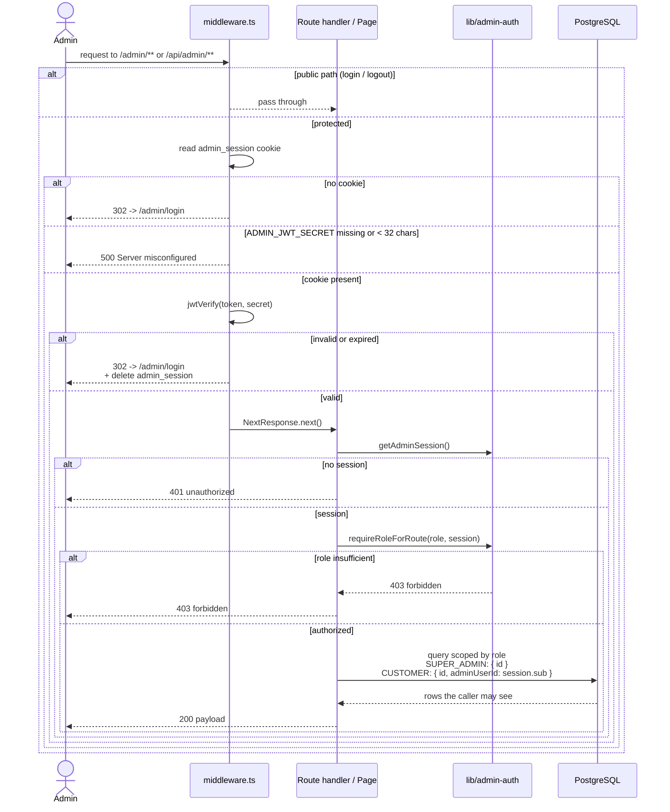
```mermaid
sequenceDiagram
    actor OP as Admin
    participant MW as middleware.ts
    participant R as Route handler / Page
    participant Auth as lib/admin-auth
    participant DB as PostgreSQL

    OP->>MW: request to /admin/** or /api/admin/**
    alt public path (login / logout)
        MW-->>R: pass through
    else protected
        MW->>MW: read admin_session cookie
        alt no cookie
            MW-->>OP: 302 -> /admin/login
        else ADMIN_JWT_SECRET missing or < 32 chars
            MW-->>OP: 500 Server misconfigured
        else cookie present
            MW->>MW: jwtVerify(token, secret)
            alt invalid or expired
                MW-->>OP: 302 -> /admin/login<br/>+ delete admin_session
            else valid
                MW->>R: NextResponse.next()
                R->>Auth: getAdminSession()
                alt no session
                    R-->>OP: 401 unauthorized
                else session
                    R->>Auth: requireRoleForRoute(role, session)
                    alt role insufficient
                        Auth-->>R: 403 forbidden
                        R-->>OP: 403 forbidden
                    else authorized
                        R->>DB: query scoped by role<br/>SUPER_ADMIN: { id }<br/>CUSTOMER: { id, adminUserId: session.sub }
                        DB-->>R: rows the caller may see
                        R-->>OP: 200 payload
                    end
                end
            end
        end
    end
```

The role-scoped `where` clause in the last step is what prevents IDOR across customers: a
`CUSTOMER` asking for someone else's campaign gets `404 not_found`, not `403`, because the
row simply is not in their result set.

Server components use `requireRoleForPage(role)` instead, which `redirect`s to
`/admin/login` rather than returning a 403.

---

## B. Campaign lifecycle

### B1. Create a campaign

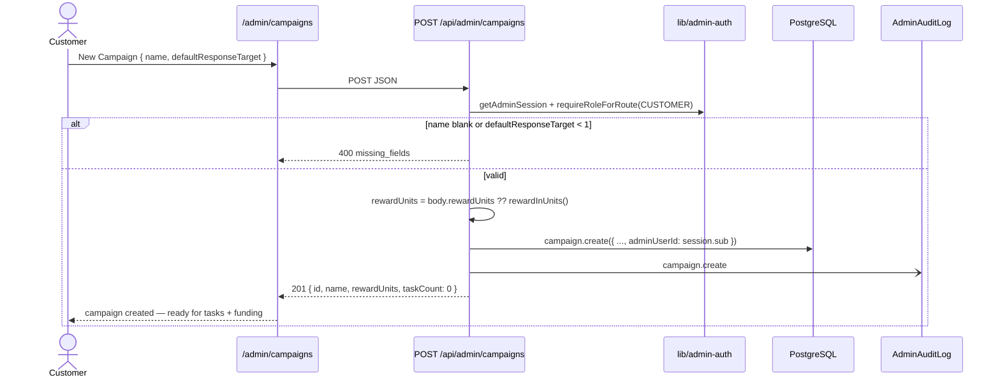
```mermaid
sequenceDiagram
    actor C as Customer
    participant UI as /admin/campaigns
    participant API as POST /api/admin/campaigns
    participant Auth as lib/admin-auth
    participant DB as PostgreSQL
    participant Audit as AdminAuditLog

    C->>UI: New Campaign { name, defaultResponseTarget }
    UI->>API: POST JSON
    API->>Auth: getAdminSession + requireRoleForRoute(CUSTOMER)
    alt name blank or defaultResponseTarget < 1
        API-->>UI: 400 missing_fields
    else valid
        API->>API: rewardUnits = body.rewardUnits ?? rewardInUnits()
        API->>DB: campaign.create({ ..., adminUserId: session.sub })
        API-)Audit: campaign.create
        API-->>UI: 201 { id, name, rewardUnits, taskCount: 0 }
        UI-->>C: campaign created — ready for tasks + funding
    end
```

The campaign is owned by whoever created it (`adminUserId: session.sub`), and that
ownership is the basis of every later `where` clause.

### B2. Upload tasks from CSV — accept and enqueue

The upload route never holds the request open for the row work. It validates, parses
cheaply, persists the raw CSV as an `upload_jobs` row, and returns **202** immediately. The
rows are upserted afterwards by a worker.

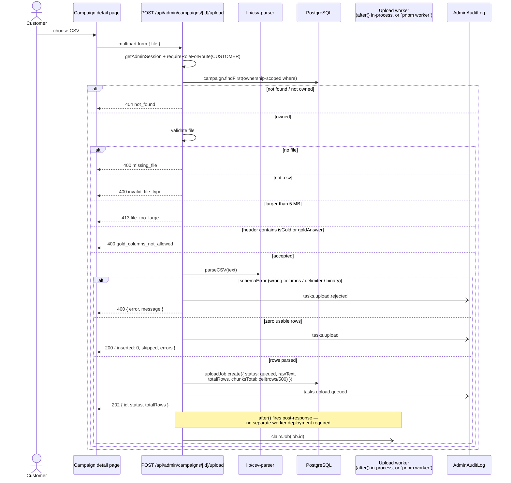
```mermaid
sequenceDiagram
    actor C as Customer
    participant UI as Campaign detail page
    participant API as POST /api/admin/campaigns/[id]/upload
    participant P as lib/csv-parser
    participant DB as PostgreSQL
    participant W as Upload worker<br/>(after() in-process, or `pnpm worker`)
    participant Audit as AdminAuditLog

    C->>UI: choose CSV
    UI->>API: multipart form { file }
    API->>API: getAdminSession + requireRoleForRoute(CUSTOMER)
    API->>DB: campaign.findFirst(ownership-scoped where)
    alt not found / not owned
        API-->>UI: 404 not_found
    else owned
        API->>API: validate file
        alt no file
            API-->>UI: 400 missing_file
        else not .csv
            API-->>UI: 400 invalid_file_type
        else larger than 5 MB
            API-->>UI: 413 file_too_large
        else header contains isGold or goldAnswer
            API-->>UI: 400 gold_columns_not_allowed
        else accepted
            API->>P: parseCSV(text)
            alt schemaError (wrong columns / delimiter / binary)
                API-)Audit: tasks.upload.rejected
                API-->>UI: 400 { error, message }
            else zero usable rows
                API-)Audit: tasks.upload
                API-->>UI: 200 { inserted: 0, skipped, errors }
            else rows parsed
                API->>DB: uploadJob.create({ status: queued, rawText,<br/>totalRows, chunksTotal: ceil(rows/500) })
                API-)Audit: tasks.upload.queued
                API-->>UI: 202 { id, status, totalRows }
                Note over API,W: after() fires post-response —<br/>no separate worker deployment required
                API-)W: claimJob(job.id)
            end
        end
    end
```

Gold tasks can never come from a customer upload: the header check rejects any CSV
carrying `isGold` or `goldAnswer`, and the worker hard-codes `goldAnswer: null`. Quality
control stays on the platform-maintained gold set.

### B3. Drain the upload job, and poll it

Two consumers can reach a job — the `after()` trigger in the web server and a standalone
`pnpm worker` replica. `claimJob` / `claimNextJob` are a single atomic `UPDATE … RETURNING`,
so exactly one of them wins and the loser does nothing.

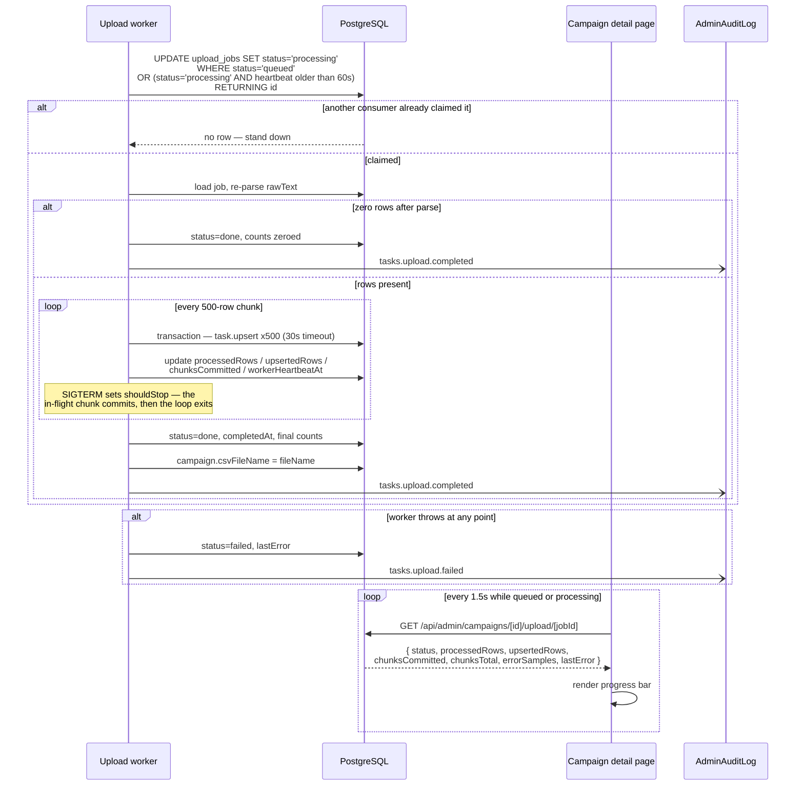
```mermaid
sequenceDiagram
    participant W as Upload worker
    participant DB as PostgreSQL
    participant UI as Campaign detail page
    participant Audit as AdminAuditLog

    W->>DB: UPDATE upload_jobs SET status='processing'<br/>WHERE status='queued'<br/>OR (status='processing' AND heartbeat older than 60s)<br/>RETURNING id
    alt another consumer already claimed it
        DB-->>W: no row — stand down
    else claimed
        W->>DB: load job, re-parse rawText
        alt zero rows after parse
            W->>DB: status=done, counts zeroed
            W-)Audit: tasks.upload.completed
        else rows present
            loop every 500-row chunk
                W->>DB: transaction — task.upsert x500 (30s timeout)
                W->>DB: update processedRows / upsertedRows /<br/>chunksCommitted / workerHeartbeatAt
                Note over W: SIGTERM sets shouldStop — the<br/>in-flight chunk commits, then the loop exits
            end
            W->>DB: status=done, completedAt, final counts
            W->>DB: campaign.csvFileName = fileName
            W-)Audit: tasks.upload.completed
        end
    end

    alt worker throws at any point
        W->>DB: status=failed, lastError
        W-)Audit: tasks.upload.failed
    end

    loop every 1.5s while queued or processing
        UI->>DB: GET /api/admin/campaigns/[id]/upload/[jobId]
        DB-->>UI: { status, processedRows, upsertedRows,<br/>chunksCommitted, chunksTotal, errorSamples, lastError }
        UI->>UI: render progress bar
    end
```

A crashed worker is recovered by the stale-heartbeat clause: a job left `processing` with a
heartbeat older than 60 seconds is re-claimable by the next consumer.

### B4. Retry a failed upload

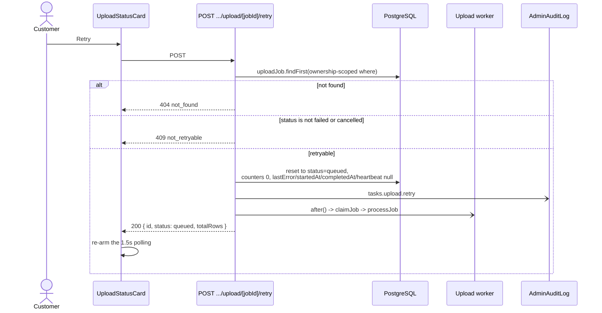
```mermaid
sequenceDiagram
    actor C as Customer
    participant UI as UploadStatusCard
    participant API as POST .../upload/[jobId]/retry
    participant DB as PostgreSQL
    participant W as Upload worker
    participant Audit as AdminAuditLog

    C->>UI: Retry
    UI->>API: POST
    API->>DB: uploadJob.findFirst(ownership-scoped where)
    alt not found
        API-->>UI: 404 not_found
    else status is not failed or cancelled
        API-->>UI: 409 not_retryable
    else retryable
        API->>DB: reset to status=queued,<br/>counters 0, lastError/startedAt/completedAt/heartbeat null
        API-)Audit: tasks.upload.retry
        API-)W: after() -> claimJob -> processJob
        API-->>UI: 200 { id, status: queued, totalRows }
        UI->>UI: re-arm the 1.5s polling
    end
```

Retries never duplicate rows: `Task` carries `@@unique([campaignId, prompt])`, so the
chunked upserts are idempotent by construction.

### B5. Fund a campaign

Deposits are **operator-only** — a customer cannot credit their own balance. This route
checks `session.role !== "SUPER_ADMIN"` directly rather than going through
`requireRoleForRoute`, because the role hierarchy must not apply here.

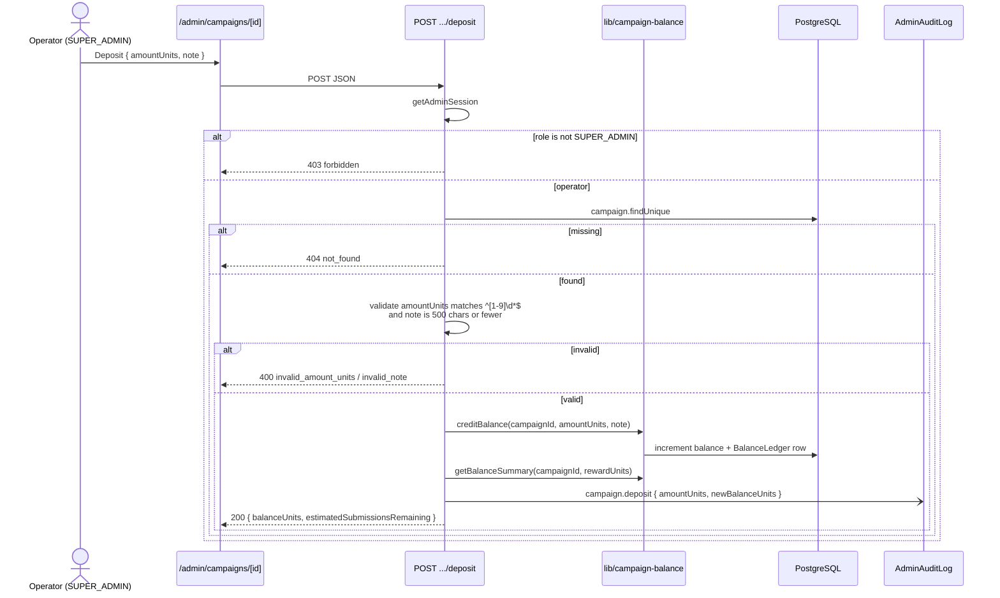
```mermaid
sequenceDiagram
    actor OP as Operator (SUPER_ADMIN)
    participant UI as /admin/campaigns/[id]
    participant API as POST .../deposit
    participant CB as lib/campaign-balance
    participant DB as PostgreSQL
    participant Audit as AdminAuditLog

    OP->>UI: Deposit { amountUnits, note }
    UI->>API: POST JSON
    API->>API: getAdminSession
    alt role is not SUPER_ADMIN
        API-->>UI: 403 forbidden
    else operator
        API->>DB: campaign.findUnique
        alt missing
            API-->>UI: 404 not_found
        else found
            API->>API: validate amountUnits matches ^[1-9]\d*$<br/>and note is 500 chars or fewer
            alt invalid
                API-->>UI: 400 invalid_amount_units / invalid_note
            else valid
                API->>CB: creditBalance(campaignId, amountUnits, note)
                CB->>DB: increment balance + BalanceLedger row
                API->>CB: getBalanceSummary(campaignId, rewardUnits)
                API-)Audit: campaign.deposit { amountUnits, newBalanceUnits }
                API-->>UI: 200 { balanceUnits, estimatedSubmissionsRemaining }
            end
        end
    end
```

The read side, `GET .../balance`, is ownership-scoped rather than operator-only: a customer
can watch their own balance and the last 10 `BalanceLedger` entries. That balance is what
`/api/submit` debits per accepted answer — when it runs out, labelers get
`402 campaign_balance_insufficient`.

---

## C. Trust & safety — `SUPER_ADMIN` only

### C1. Review a flagged withdrawal

Withdrawal attempts that trip an anti-fraud gate land in `FlaggedWithdrawal` as `PENDING`.
The queue page shows the newest 200, sorted by severity tier first
(`CRITICAL → HIGH → LOW`) and recency within a tier.

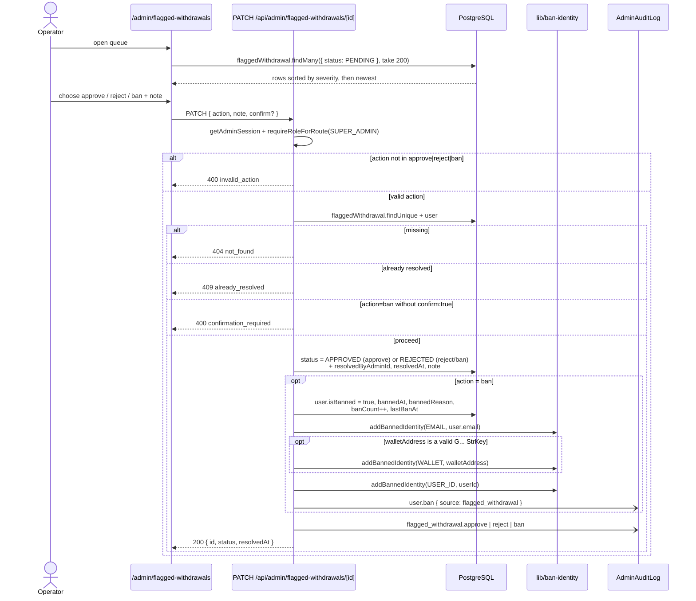
```mermaid
sequenceDiagram
    actor OP as Operator
    participant UI as /admin/flagged-withdrawals
    participant API as PATCH /api/admin/flagged-withdrawals/[id]
    participant DB as PostgreSQL
    participant BAN as lib/ban-identity
    participant Audit as AdminAuditLog

    OP->>UI: open queue
    UI->>DB: flaggedWithdrawal.findMany({ status: PENDING }, take 200)
    DB-->>UI: rows sorted by severity, then newest
    OP->>UI: choose approve / reject / ban + note

    UI->>API: PATCH { action, note, confirm? }
    API->>API: getAdminSession + requireRoleForRoute(SUPER_ADMIN)
    alt action not in approve|reject|ban
        API-->>UI: 400 invalid_action
    else valid action
        API->>DB: flaggedWithdrawal.findUnique + user
        alt missing
            API-->>UI: 404 not_found
        else already resolved
            API-->>UI: 409 already_resolved
        else action=ban without confirm:true
            API-->>UI: 400 confirmation_required
        else proceed
            API->>DB: status = APPROVED (approve) or REJECTED (reject/ban)<br/>+ resolvedByAdminId, resolvedAt, note
            opt action = ban
                API->>DB: user.isBanned = true, bannedAt, bannedReason,<br/>banCount++, lastBanAt
                API->>BAN: addBannedIdentity(EMAIL, user.email)
                opt walletAddress is a valid G... StrKey
                    API->>BAN: addBannedIdentity(WALLET, walletAddress)
                end
                API->>BAN: addBannedIdentity(USER_ID, userId)
                API-)Audit: user.ban { source: flagged_withdrawal }
            end
            API-)Audit: flagged_withdrawal.approve | reject | ban
            API-->>UI: 200 { id, status, resolvedAt }
        end
    end
```

Three things worth reading off this diagram:

- **`approve` unblocks, it does not pay.** Clearing the flag lets the labeler *retry* the
  withdrawal through the normal gate; no payout is enqueued here.
- **`ban` requires `confirm: true` server-side**, not just a UI modal. The check is
  enforced in the route so a direct API call cannot skip it.
- **The ban binds every identifier on the account** — email, wallet, and user id — so the
  same person is refused at the next withdrawal under any one of them. A malformed stored
  wallet is skipped rather than stored as an un-matchable ban, which would otherwise throw
  *after* the flag and user rows were already written and leave a half-applied ban.

### C2. Resolve a dispute

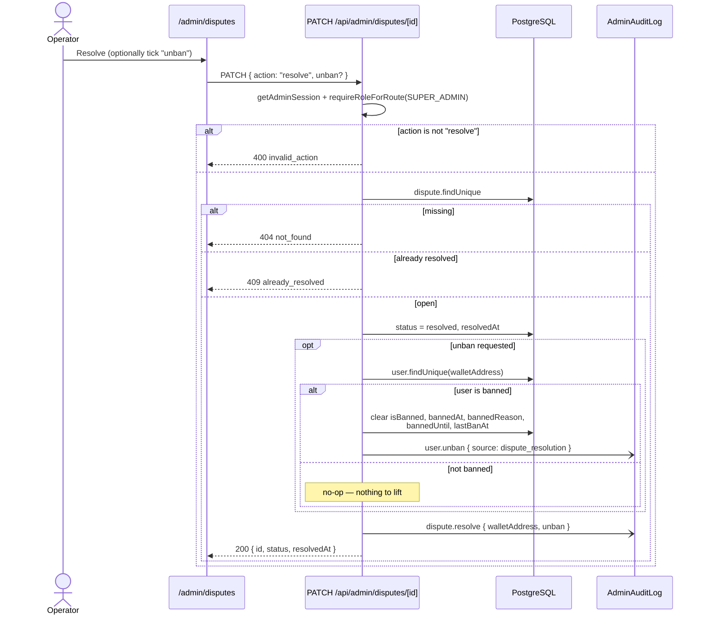
```mermaid
sequenceDiagram
    actor OP as Operator
    participant UI as /admin/disputes
    participant API as PATCH /api/admin/disputes/[id]
    participant DB as PostgreSQL
    participant Audit as AdminAuditLog

    OP->>UI: Resolve (optionally tick "unban")
    UI->>API: PATCH { action: "resolve", unban? }
    API->>API: getAdminSession + requireRoleForRoute(SUPER_ADMIN)
    alt action is not "resolve"
        API-->>UI: 400 invalid_action
    else
        API->>DB: dispute.findUnique
        alt missing
            API-->>UI: 404 not_found
        else already resolved
            API-->>UI: 409 already_resolved
        else open
            API->>DB: status = resolved, resolvedAt
            opt unban requested
                API->>DB: user.findUnique(walletAddress)
                alt user is banned
                    API->>DB: clear isBanned, bannedAt, bannedReason,<br/>bannedUntil, lastBanAt
                    API-)Audit: user.unban { source: dispute_resolution }
                else not banned
                    Note over API: no-op — nothing to lift
                end
            end
            API-)Audit: dispute.resolve { walletAddress, unban }
            API-->>UI: 200 { id, status, resolvedAt }
        end
    end
```

### C3. Ban or unban from the user profile

The direct lever, separate from the flagged-withdrawal and dispute paths.

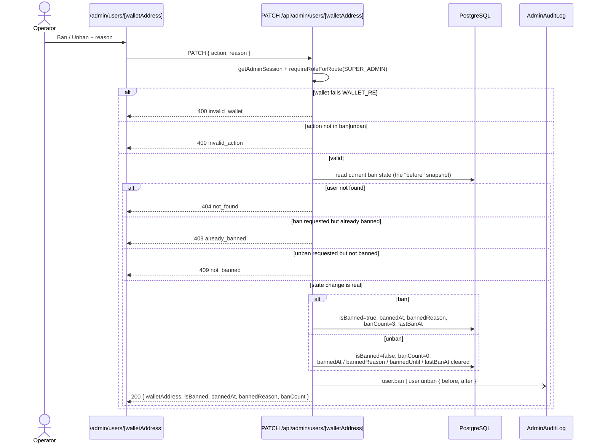
```mermaid
sequenceDiagram
    actor OP as Operator
    participant UI as /admin/users/[walletAddress]
    participant API as PATCH /api/admin/users/[walletAddress]
    participant DB as PostgreSQL
    participant Audit as AdminAuditLog

    OP->>UI: Ban / Unban + reason
    UI->>API: PATCH { action, reason }
    API->>API: getAdminSession + requireRoleForRoute(SUPER_ADMIN)
    alt wallet fails WALLET_RE
        API-->>UI: 400 invalid_wallet
    else action not in ban|unban
        API-->>UI: 400 invalid_action
    else valid
        API->>DB: read current ban state (the "before" snapshot)
        alt user not found
            API-->>UI: 404 not_found
        else ban requested but already banned
            API-->>UI: 409 already_banned
        else unban requested but not banned
            API-->>UI: 409 not_banned
        else state change is real
            alt ban
                API->>DB: isBanned=true, bannedAt, bannedReason,<br/>banCount=3, lastBanAt
            else unban
                API->>DB: isBanned=false, banCount=0,<br/>bannedAt / bannedReason / bannedUntil / lastBanAt cleared
            end
            API-)Audit: user.ban | user.unban { before, after }
            API-->>UI: 200 { walletAddress, isBanned, bannedAt, bannedReason, banCount }
        end
    end
```

An operator ban pins `banCount` to `3` deliberately — that is at the automatic gold-task
ban threshold, so the account cannot drift back under it and be treated as a first-time
offender. An unban resets the counter to `0`.

---

## D. Payout operations — `SUPER_ADMIN` only

### D1. Manually retry a failed payout

The most safety-critical operator action in the app: a careless retry pays twice. It is
split into two phases so that a database failure after broadcast can never roll back a
persisted `txHash`.

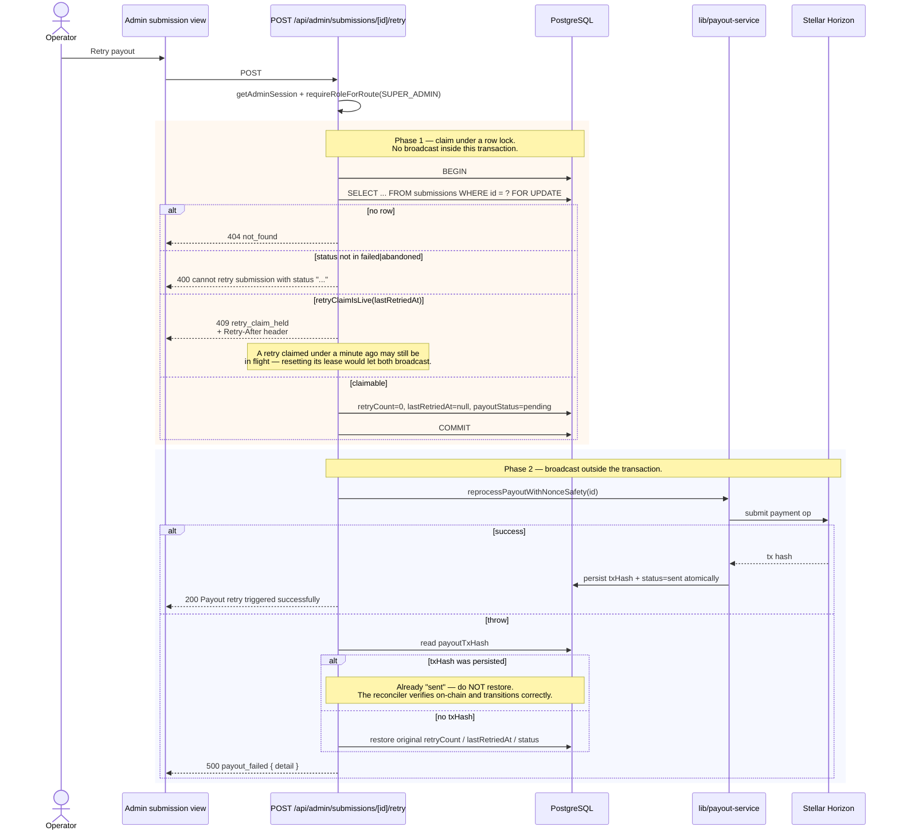
```mermaid
sequenceDiagram
    actor OP as Operator
    participant UI as Admin submission view
    participant API as POST /api/admin/submissions/[id]/retry
    participant DB as PostgreSQL
    participant PS as lib/payout-service
    participant HZ as Stellar Horizon

    OP->>UI: Retry payout
    UI->>API: POST
    API->>API: getAdminSession + requireRoleForRoute(SUPER_ADMIN)

    rect rgba(255,244,230,0.6)
        Note over API,DB: Phase 1 — claim under a row lock.<br/>No broadcast inside this transaction.
        API->>DB: BEGIN
        API->>DB: SELECT ... FROM submissions WHERE id = ? FOR UPDATE
        alt no row
            API-->>UI: 404 not_found
        else status not in failed|abandoned
            API-->>UI: 400 cannot retry submission with status "..."
        else retryClaimIsLive(lastRetriedAt)
            API-->>UI: 409 retry_claim_held<br/>+ Retry-After header
            Note over API: A retry claimed under a minute ago may still be<br/>in flight — resetting its lease would let both broadcast.
        else claimable
            API->>DB: retryCount=0, lastRetriedAt=null, payoutStatus=pending
            API->>DB: COMMIT
        end
    end

    rect rgba(240,244,255,0.6)
        Note over API,HZ: Phase 2 — broadcast outside the transaction.
        API->>PS: reprocessPayoutWithNonceSafety(id)
        PS->>HZ: submit payment op
        alt success
            HZ-->>PS: tx hash
            PS->>DB: persist txHash + status=sent atomically
            API-->>UI: 200 Payout retry triggered successfully
        else throw
            API->>DB: read payoutTxHash
            alt txHash was persisted
                Note over API,DB: Already "sent" — do NOT restore.<br/>The reconciler verifies on-chain and transitions correctly.
            else no txHash
                API->>DB: restore original retryCount / lastRetriedAt / status
            end
            API-->>UI: 500 payout_failed { detail }
        end
    end
```

`retryClaimIsLive` is conservative by construction: it also refuses for up to a minute
after a retry that has already *finished*. The route says so plainly in its 409 detail
rather than claiming a broadcast is definitely in flight.

### D2. Health and ops dashboards

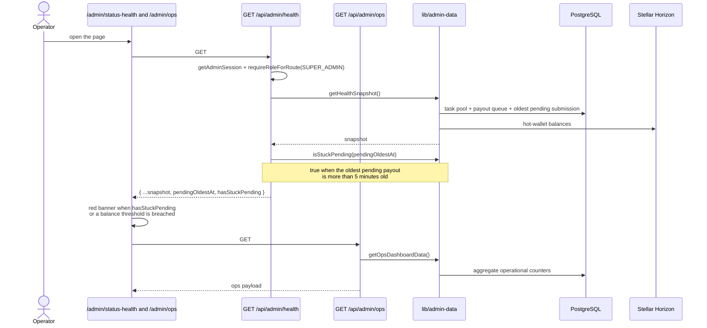
```mermaid
sequenceDiagram
    actor OP as Operator
    participant UI as /admin/status-health and /admin/ops
    participant H as GET /api/admin/health
    participant O as GET /api/admin/ops
    participant AD as lib/admin-data
    participant DB as PostgreSQL
    participant HZ as Stellar Horizon

    OP->>UI: open the page
    UI->>H: GET
    H->>H: getAdminSession + requireRoleForRoute(SUPER_ADMIN)
    H->>AD: getHealthSnapshot()
    AD->>DB: task pool + payout queue + oldest pending submission
    AD->>HZ: hot-wallet balances
    AD-->>H: snapshot
    H->>AD: isStuckPending(pendingOldestAt)
    Note over H,AD: true when the oldest pending payout<br/>is more than 5 minutes old
    H-->>UI: { ...snapshot, pendingOldestAt, hasStuckPending }
    UI->>UI: red banner when hasStuckPending<br/>or a balance threshold is breached

    UI->>O: GET
    O->>AD: getOpsDashboardData()
    AD->>DB: aggregate operational counters
    O-->>UI: ops payload
```

### D3. Scheduled jobs

The four cron routes are not part of the admin UI, but they are the operator's automation
and they share one authentication scheme: a `Bearer ${CRON_SECRET}` `Authorization` header,
checked by `authenticateCron`. There is no cookie and no role — a missing or unset
`CRON_SECRET` fails closed with `401`.

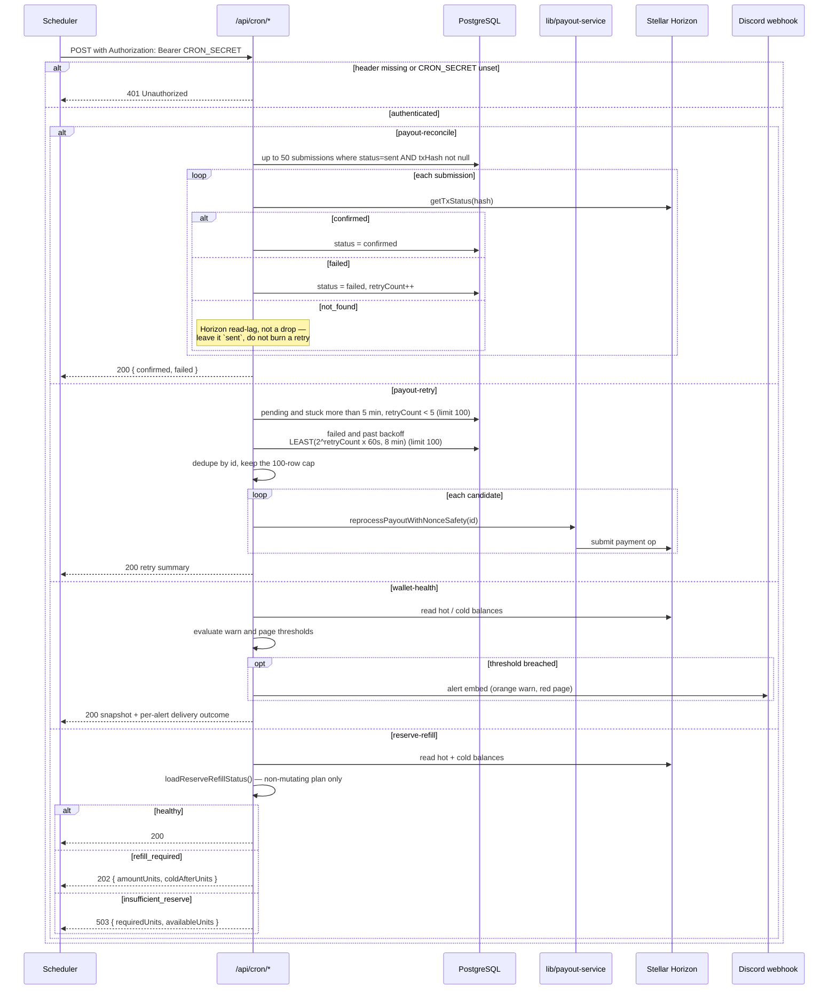
```mermaid
sequenceDiagram
    participant S as Scheduler
    participant CR as /api/cron/*
    participant DB as PostgreSQL
    participant PS as lib/payout-service
    participant HZ as Stellar Horizon
    participant DSC as Discord webhook

    S->>CR: POST with Authorization: Bearer CRON_SECRET
    alt header missing or CRON_SECRET unset
        CR-->>S: 401 Unauthorized
    else authenticated

        alt payout-reconcile
            CR->>DB: up to 50 submissions where status=sent AND txHash not null
            loop each submission
                CR->>HZ: getTxStatus(hash)
                alt confirmed
                    CR->>DB: status = confirmed
                else failed
                    CR->>DB: status = failed, retryCount++
                else not_found
                    Note over CR: Horizon read-lag, not a drop —<br/>leave it `sent`, do not burn a retry
                end
            end
            CR-->>S: 200 { confirmed, failed }

        else payout-retry
            CR->>DB: pending and stuck more than 5 min, retryCount < 5 (limit 100)
            CR->>DB: failed and past backoff<br/>LEAST(2^retryCount x 60s, 8 min) (limit 100)
            CR->>CR: dedupe by id, keep the 100-row cap
            loop each candidate
                CR->>PS: reprocessPayoutWithNonceSafety(id)
                PS->>HZ: submit payment op
            end
            CR-->>S: 200 retry summary

        else wallet-health
            CR->>HZ: read hot / cold balances
            CR->>CR: evaluate warn and page thresholds
            opt threshold breached
                CR->>DSC: alert embed (orange warn, red page)
            end
            CR-->>S: 200 snapshot + per-alert delivery outcome

        else reserve-refill
            CR->>HZ: read hot + cold balances
            CR->>CR: loadReserveRefillStatus() — non-mutating plan only
            alt healthy
                CR-->>S: 200
            else refill_required
                CR-->>S: 202 { amountUnits, coldAfterUnits }
            else insufficient_reserve
                CR-->>S: 503 { requiredUnits, availableUnits }
            end
        end
    end
```

`reserve-refill` deliberately **only reports**. It never moves funds: a cold-to-hot
transfer needs two of the three configured cold-reserve identities to sign the exact
transaction, which no scheduled job can do on its own. See
[`stellar-cold-reserve-runbook.md`](./stellar-cold-reserve-runbook.md).

---

## E. Dataset export

Two export routes exist: a global one filtered by query string, and a per-campaign one.
Both return only submissions whose payout actually settled (`payoutStatus: "sent"`), and
both assign a deterministic `train` / `test` / `validation` split by hashing the record id
(80 / 10 / 10) so repeated exports are stable.

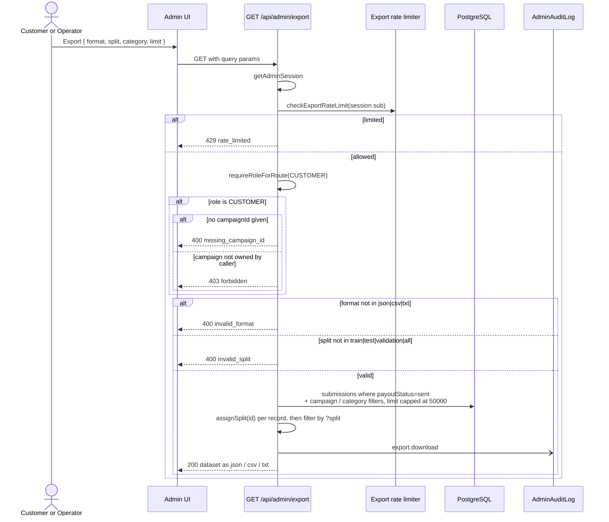
```mermaid
sequenceDiagram
    actor C as Customer or Operator
    participant UI as Admin UI
    participant API as GET /api/admin/export
    participant RL as Export rate limiter
    participant DB as PostgreSQL
    participant Audit as AdminAuditLog

    C->>UI: Export { format, split, category, limit }
    UI->>API: GET with query params
    API->>API: getAdminSession
    API->>RL: checkExportRateLimit(session.sub)
    alt limited
        API-->>UI: 429 rate_limited
    else allowed
        API->>API: requireRoleForRoute(CUSTOMER)
        alt role is CUSTOMER
            alt no campaignId given
                API-->>UI: 400 missing_campaign_id
            else campaign not owned by caller
                API-->>UI: 403 forbidden
            end
        end
        alt format not in json|csv|txt
            API-->>UI: 400 invalid_format
        else split not in train|test|validation|all
            API-->>UI: 400 invalid_split
        else valid
            API->>DB: submissions where payoutStatus=sent<br/>+ campaign / category filters, limit capped at 50000
            API->>API: assignSplit(id) per record, then filter by ?split
            API-)Audit: export.download
            API-->>UI: 200 dataset as json / csv / txt
        end
    end
```

The rate-limit check runs **before** the role check, so a spamming caller is throttled
regardless of what they are entitled to. `assertExportAllowed()` on the per-campaign route
is currently a no-op seam reserved for a future billing/entitlement gate — authorization
today is enforced entirely by the ownership `where` clause.

---

## Related documents

- [`README.md`](../README.md#sequence-diagrams) — system architecture and the three labeler-side sequence diagrams
- [`payout-and-withdrawal-redesign.md`](./payout-and-withdrawal-redesign.md) — §6 is the source of truth for the live accrue-then-withdraw model
- [`stellar-multisig-payout-service.md`](./stellar-multisig-payout-service.md) — how a payout is assembled and signed
- [`stellar-payout-failure-runbook.md`](./stellar-payout-failure-runbook.md) — every payout failure mode and the operator response
- [`stellar-cold-reserve-runbook.md`](./stellar-cold-reserve-runbook.md) — hot/cold separation and the refill procedure
- [`features.md`](./features.md) — running log of shipped admin features and the issues behind them
