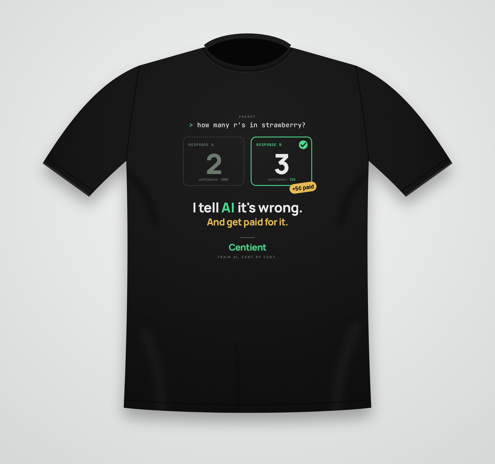

# Centient tee — "I tell AI it's wrong."

Front chest print for a **black** crew-neck tee.

The joke is the product: a labeler is shown the famous "how many r's in strawberry?"
prompt, Response A says **2** with 100% confidence, Response B says **3** with 51%.
They pick B, a `+5¢ paid` sticker lands on it, and the shirt says
**"I tell AI it's wrong. And get paid for it."**

## Files

| File | Use |
|---|---|
| `centient-tee-print-3600px.png` | Print file. Transparent PNG, 3600 × 3990 px = 12 × 13.3 in at 300 dpi. |
| `centient-tee-artwork.svg` | Editable vector source. Fonts are embedded, so it renders the same anywhere. |
| `centient-tee-mockup.jpg` | Preview on a black tee. |

## Inks (4 spot colours, all brand tokens)

| Ink | Hex | Token |
|---|---|---|
| Off-white | `#f0f1f3` | `inverse-on-surface` |
| Green | `#4ae08d` | `inverse-primary` |
| Gold | `#eec052` | `secondary-fixed-dim` |
| Gray | `#6c7b6e` | `outline` |

The check mark and the `+5¢ paid` text are pure black and should print as a
**knockout** (no ink, shirt shows through).

Type: Manrope 800 (headline, numerals, wordmark), JetBrains Mono (prompt and card
labels), Inter 600 (tagline).

Placement: centred, about 3 in below the collar seam, 11–12 in wide on an adult M/L.
